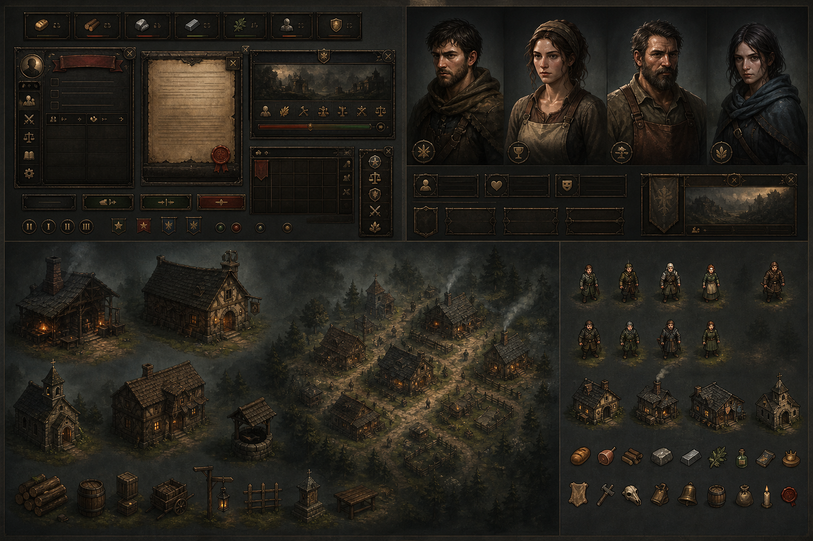

# Valdeniebla - Visual Asset Foundation

## Objetivo

Esta PR rehace la base visual como una referencia de arte real, no como wireframes ni siluetas geometricas. El objetivo es fijar el nivel de ambicion antes de producir assets finales para Godot: UI premium de estrategia, retratos RPG semi-pintados, edificios atmosfericos, props, iconos y sprites de mapa.

La referencia no copia CK3, Total War ni Baldur's Gate. Usa esos juegos como liston de acabado: interfaces con materialidad, personajes con presencia, mapa que ocupa la pantalla y elementos clicables que parecen parte de un juego comercial.

## Target Art



Archivo: [docs/art_direction/valdeniebla_target_art_board.png](art_direction/valdeniebla_target_art_board.png)

Esta lamina es el contrato visual para la siguiente fase. No es un atlas final ni debe colocarse tal cual en runtime, pero marca claramente hacia donde producir:

- UI medieval oscura con pergamino, madera vieja, laton envejecido y textura.
- Retratos serios, humanos y semi-pintados, con ropa de oficio y expresion contenida.
- Mapa 2.5D de aldea con niebla, caminos, bosque, luz calida y siluetas legibles.
- Edificios con identidad funcional: herreria, taberna, capilla, casa comunal, pozo.
- Props e iconos con volumen y material, no pictogramas planos improvisados.

## Direccion Artistica

Valdeniebla debe sentirse como una aldea fronteriza que sobrevive dentro de una niebla hostil. La pantalla principal debe vender lugar, atmosfera y tension antes que estadisticas.

Principios:

- El mapa es la escena principal. La UI flota encima y ocupa lo minimo.
- Las ventanas emergentes deben parecer objetos de juego: pergamino oscuro, madera, laton, sombras suaves.
- Los NPCs deben reconocerse por oficio, pose y silueta, no solo por etiqueta.
- Los edificios deben comunicar funcion antes de leer el nombre.
- La paleta mezcla frio exterior con calor humano: musgo, barro, carbon, niebla gris, ambar, brasa, laton viejo.
- La textura debe ser rica pero controlada para no competir con lectura ni interaccion.

## Sistemas Visuales

### UI

La UI actual puede seguir usando controles de Godot, pero debe evolucionar hacia una capa con assets reales:

- Chips compactos de recursos: icono pintado + numero, sin barra negra detras.
- Popups contextuales arrastrables con cabecera, borde de laton y fondo de pergamino oscuro.
- Botones inferiores como piezas flotantes, no como una barra solida que robe mapa.
- Estados visuales para hover, seleccionado, riesgo, bloqueado y accion importante.
- Iconos de modo mapa en esquina: normal, recursos, riesgo/seguridad.

### Retratos

Los retratos deben aportar narrativa. No buscamos avatares genericos, sino vecinos concretos de Valdeniebla.

- Aldric: joven herrero, hollin, cansancio, herramienta visible.
- Gareth: herrero pesado, delantal oscuro, presencia de oficio.
- Mara: tabernera, gesto social, luz calida, ropa gastada.
- Elowen: curandera, hierbas/vendas, calma reservada.
- Oren: alcalde, ropa mejor pero usada, gesto preocupado.
- Tomas: escriba, libro/pluma, mirada analitica.
- Bran: granjero, cuerpo robusto, tonos tierra.
- Lysa: pastora, capa corta, verdes/grises, postura alerta.

### Mapa y Entorno

La aldea debe dejar atras el aspecto de diagrama. La proxima produccion visual debe reemplazar formas planas por assets con volumen:

- Herreria: chimenea, humo, brasas, yunque o zona de trabajo.
- Taberna: cartel, barriles, luz interior, actividad social.
- Casa comunal: volumen central, mesa/eje administrativo, sobriedad.
- Capilla: piedra/madera, campana o cruz simple, recogimiento.
- Pozo: piedra, cubo, cuerda, nodo social claro.
- Campos y prados: vallas, surcos, vegetacion baja, ganado sugerido.
- Bosque y niebla: profundidad por capas, no circulos planos.

### Sprites e Iconos

Los sprites de mapa tienen que funcionar a 64x64 o 96x96, pero conviene generarlos desde maestros mayores.

- Sprites de NPC: PNG transparente, maestro 256x256 o 512x512.
- Edificios: PNG transparente, maestro 512x512 o 1024x1024.
- Retratos: PNG maestro 1024x1024, runtime 256x256 o 384x384.
- UI: PNG 9-slice para paneles/botones, SVG solo para iconos editables si conviene.
- Iconos de recursos: alimento, madera, hierro, medicina, moral y seguridad con estilo pintado coherente.

## Primera Produccion Recomendada

La siguiente PR deberia ser `production-ui-and-sprite-assets-p0`.

Alcance minimo:

1. Reemplazar los chips de recursos por iconos pintados y marcos compactos.
2. Crear un popup panel 9-slice con estados de cabecera y boton.
3. Producir sprites de los 8 protagonistas para el mapa.
4. Producir 4 edificios clave: herreria, taberna, casa comunal y capilla.
5. Producir props pequenos: barriles, lena, sacos, vallas, humo/bruma.
6. Integrar todo en `VillageMapView` con fallback procedural si falta algun PNG.

No incluir todavia:

- Retratos finales grandes de todos los personajes.
- Variantes estacionales.
- Fondos interiores narrativos.
- Todos los edificios secundarios.

## Prompts Base

### Sprite de protagonista

```text
Small 2D stylized game world sprite of [character], medieval frontier village inhabitant, clear readable silhouette, transparent background, muted moss and warm earth palette, simple painterly shading, visible role prop ([prop]), not heroic fantasy, not cartoon outline, compatible with top-down village map, readable at 64x64.
```

### Edificio

```text
2D stylized medieval village building asset, [building], slight top-down / 2.5D view, worn wood and stone, muted mossy palette, subtle warm interior light, transparent background, readable silhouette, grounded rustic frontier village, no text, no high fantasy, no cartoon black outline.
```

### Popup UI

```text
Dark medieval parchment game UI popup panel, old wood and tarnished brass border, subtle worn texture, charcoal green-black background, elegant readable fantasy strategy UI, 9-slice friendly, no text, no symbols, no excessive ornament.
```

### Retrato

```text
2D semi-painted RPG character portrait of [character], medieval frontier village inhabitant, grounded realistic worn clothing, human tired expression, subtle misty background, warm side light and cool green-gray shadows, high quality game portrait, no heroic armor, no modern elements, no cartoon outline.
```

## Criterios de Aceptacion

Un asset entra en el juego si:

- Se lee bien al tamano real de uso.
- Refuerza oficio, lugar o decision.
- Encaja con la paleta de Valdeniebla.
- No tapa ni compite con el mapa.
- Tiene materialidad: tela, cuero, madera, piedra, metal, niebla o barro.
- Mantiene una direccion coherente con el resto del lote.
- Al verlo aislado, no parece placeholder geometrico.
